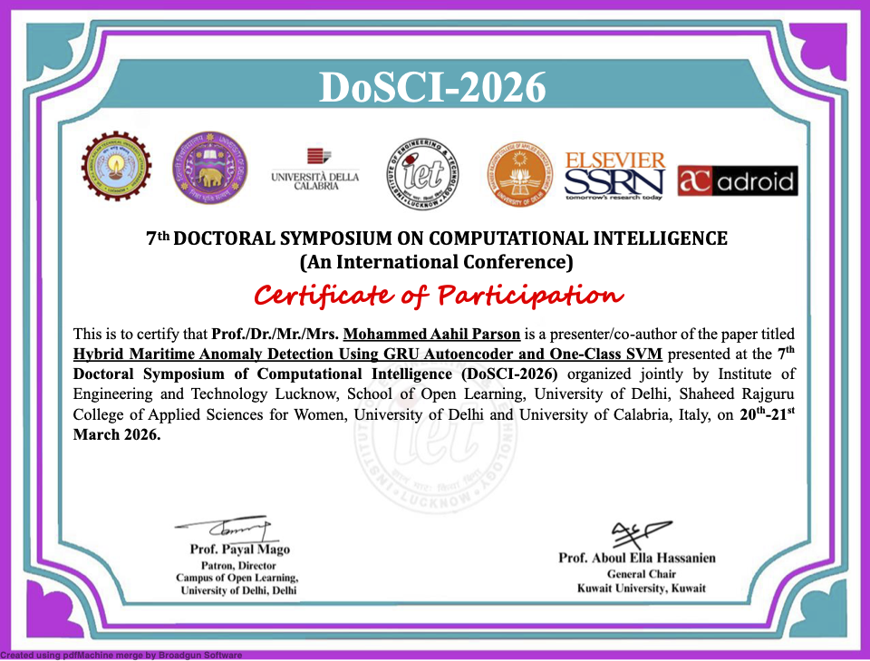

# 🚢 Hybrid Maritime Anomaly Detection Using GRU Autoencoder and One-Class SVM

> Detecting unusual vessel movement patterns from AIS trajectory data using a lightweight hybrid deep learning pipeline.

---

## 📄 Paper

**Title:** [Hybrid Maritime Anomaly Detection Using GRU Autoencoder and One-Class SVM](https://papers.ssrn.com/sol3/papers.cfm?abstract_id=6347558)  
**Authors:** Mohammed Aahil Parson, Divyaprabha K N  
**Affiliation:** PES University, Bangalore, India  
📖 [Read the paper on SSRN](https://papers.ssrn.com/sol3/papers.cfm?abstract_id=6347558)

---

## 📦 Dataset

This project uses **Baltic Sea AIS trajectory data (2017–2019)** sourced from [GitHub – Marine Traffic Modelling](https://github.com/hakola/marine-traffic-modelling?tab=readme-ov-file).

---

## 🔍 Project Overview

Detecting anomalous vessel behavior is challenging — real-world anomaly labels are scarce and AIS data is often noisy or incomplete.

This project tackles the problem with a simple hybrid pipeline:

- 🧠 **GRU Autoencoder** — learns compact representations of normal vessel trajectories
- 🎯 **One-Class SVM** — detects abnormal patterns in the learned latent space

This makes the approach practical for anomaly detection in **low-label environments**.

---

## ✨ Key Highlights

- 📡 Uses **AIS trajectory data** from the Baltic Sea
- 🪟 Works on **fixed 10-step trajectory windows**
- 📐 Learns **normal vessel movement patterns**
- 🚨 Detects anomalies **without relying on labeled abnormal data**
- 🧪 Evaluated using realistic synthetic anomaly scenarios
- ⚡ Achieves strong results with a **lightweight pipeline**

---

## 🛠️ Method

### 1. Data Preparation
AIS trajectories are split into fixed-length windows and normalized before training. Missing values are handled using interpolation.

### 2. Feature Learning
A **Bidirectional GRU Autoencoder** learns a compact latent representation of normal ship movement.

### 3. Anomaly Detection
The latent vectors are passed to a **One-Class SVM**, which flags patterns that fall outside the learned boundary of normal behavior.

---

## 🧪 Evaluation

The model was tested against the following synthetic anomaly patterns:

| Anomaly Type | Description |
|---|---|
| Speed Spike | Sudden, unrealistic acceleration |
| Direction Change | Abrupt heading shifts |
| Location Jump | Teleportation-like positional gaps |
| Slow Movement | Irregular, unusually slow traversal |

---

## 📊 Results

| Metric | Score |
|---|---|
| **Precision** | 99.20% |
| **Recall** | 74.04% |
| **F1-Score** | 84.79% |

The hybrid GRU-AE + One-Class SVM model effectively detects anomalous trajectories while remaining computationally efficient.

---

## 🌍 Why This Matters

This work is designed for real-world maritime monitoring systems where anomaly labels are scarce and fast, lightweight detection is critical.

**Potential applications include:**
- 🛳️ Maritime surveillance
- 🏗️ Port and coastal security
- 🔎 Suspicious trajectory detection
- 📡 AIS-based vessel behavior monitoring

---

## 📝 Citation

If you use this repository or build upon this work, please cite:

**Mohammed Aahil Parson, Divyaprabha K N**  
[*Hybrid Maritime Anomaly Detection Using GRU Autoencoder and One-Class SVM*](https://papers.ssrn.com/sol3/papers.cfm?abstract_id=6347558)  
SSRN

---

## 🏆 Conference Certificate

This paper was presented at the **International Conference on Innovative Computing and Communication (ICICC)**.

---

## 🙏 Acknowledgment

This repository is based on published research on maritime anomaly detection using AIS trajectory data, with a focus on building a practical and efficient anomaly detection pipeline.
